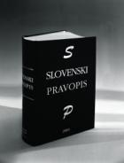
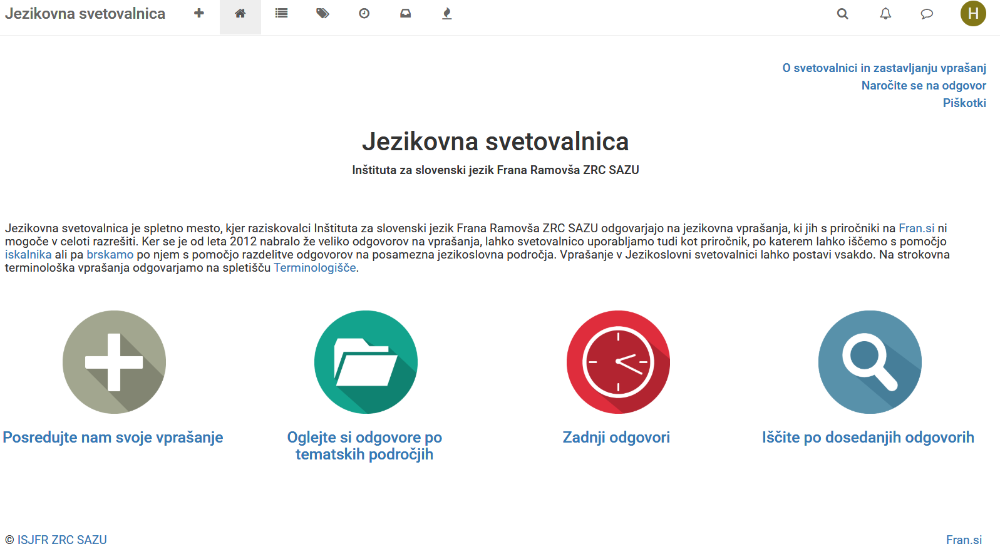

# Slovenski pravopis
## *Slovenski pravopis* 2001
:::: {.columns}

::: {.column width="40%"}
{width=80%}
:::

::: {.column width="60%"}
- 1972: Komisija za gramatiko, pravopis in pravorečje pri SAZU (A.
  Bajec, J. Rigler in J. Toporišič);

- 1977, 1979, 1980: Objava poglavij s komentarji v *Slavistični reviji*;

- 1981: *Načrt pravil za novi slovenski pravopis*

- 1990: *Slovenski pravopis: I. Pravila*

- 2001: *Slovenski pravopis: II. Slovar*
:::
::::

## *Slovenski pravopis* 8.0

- [Jezikovna
  svetovalnica](http://www.fran.si/iskanje?FilteredDictionaryIds=151&View=1&Query=%2A)

- 2013: [Pravopisna komisija pri SAZU (in ZRC
  SAZU)](http://pravopisna-komisija.sazu.si/Domov.aspx)

- [ePravopis: Slovar slovenskega pravopisa
  2014--](http://www.fran.si/iskanje?FilteredDictionaryIds=135&View=1&Query=%2A)

- [[Pravopis 8.0: Pravila novega slovenskega pravopisa za javno
  razpravo](https://www.fran.si/pravopis8)]{.ann .ann-w .ann-rainbow data-note="izšel naj bi februarja 2027"}

::: center
{width=80%}
:::
